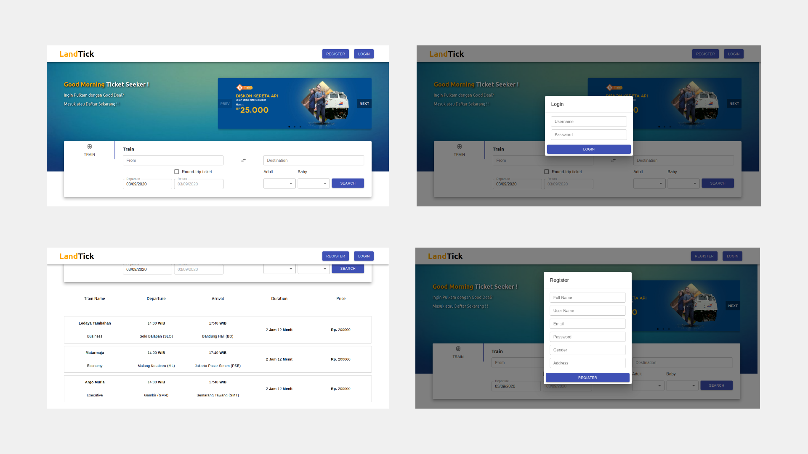
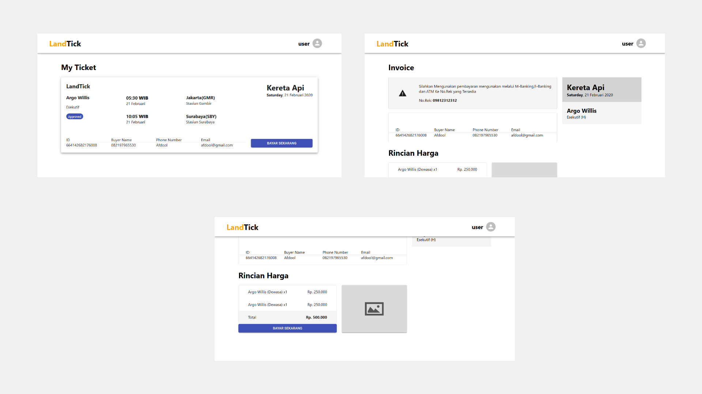
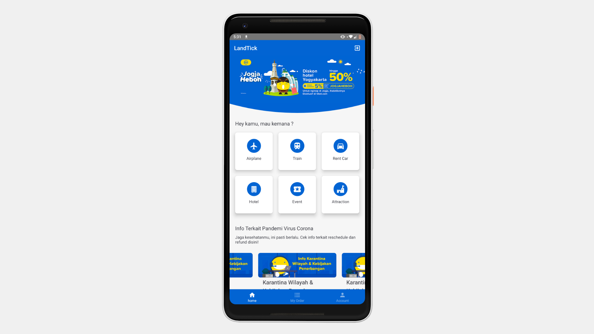

# LANDTICK

LandTick is an application that provides train tickets booking services

## Table of Contents

- [Getting Started](#getting-started)
  - [Prerequisites](#prerequisites)
  - [Installation](#installation)
  - [Setup](#Setup)
  - [Run the React Native](#React_Native)
  - [Run the ReactJs Client](#ReactJs_client)
- [Screenshots](#screenshots)
- [Built With](#built-with)
- [Author](#author)

## Getting Started

Before starting to install the project, there're some things that need to be done first.

### Prerequisites

Make sure all of these are properly installed in your system.

| Application | Download                                                                             |
| ----------- | ------------------------------------------------------------------------------------ |
| Git         | [Windows](https://desktop.github.com/) / [Linux](https://git-scm.com/download/linux) |
| Node.js     | [Link](https://nodejs.org/en/download/)                                              |
| React.js    | [Link](https://reactjs.org)                                                          |
| MySQL       | [Link](https://www.mysql.com/downloads/)                                             |

### Installation

First, clone this repository into your system.

```
git clone https://github.com/RiskySaptra/dw14qwo0n_landTick
```

Then, install all the packages that described in `package.json` of both `LandTick` For React Native and `client` For ReactJs Front-end and `server` directories for the Back-end .

```
npm install
```

### Setup

For the server setup, first, make sure your MySQL services is running fine. In `server` directory, you'll find `config.json` inside `config` folder. Open and edit the `development` configuration to match your database setup.

```
  "development": {
    "username": "root",
    "password": null,
    "database": "YOUR_DATABASE",
    "host": "127.0.0.1",
    "dialect": "mysql",
    "operatorsAliases": false
  },
```

### React_Native

```
npx react-native run-android
```

### ReactJs_client

```
npm start
```

### Run the server

```

npm start

```

## Screenshots

- **ReactJs**
  
  

- **React Native**
  

## Built With

- **Front-end**
  -- [React JS](https://reactjs.org/)
  -- [React Native](https://reactnative.dev/)
  -- [Redux](https://redux.js.org/)

- **Back-end**
  -- [Express JS](https://expressjs.com)
  -- [Sequelize](https://sequelize.org/)
  -- [MySQL](https://www.mysql.com) - Database

## Author

**Muhammad Rizky Saputra** - [RiskySaptra](https://github.com/RiskySaptra)

```

```
